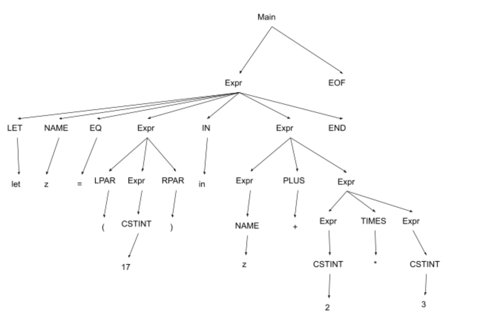

# PLC 3.3
    Main 
    -> using rule A
    Expr EOF 
    -> using rule F
    LET NAME EQ Expr IN Expr END EOF 
    -> using rule H
    LET NAME EQ Expr IN Expr PLUS Expr END EOF
    -> using rule G
    LET NAME EQ Expr IN Expr PLUS Expr TIMES Expr END EOF
    -> using rule C
    LET NAME EQ Expr IN Expr PLUS Expr TIMES CSTINT END EOF
    -> using rule C
    LET NAME EQ Expr IN Expr PLUS CSTINT TIMES CSTINT END EOF
    -> using rule B
    LET NAME EQ Expr IN NAME PLUS CSTINT TIMES CSTINT END EOF
    -> using rule E
    LET NAME EQ LPAR Expr RPAR IN NAME PLUS CSTINT TIMES CSTINT END EOF
    -> using rule C
    LET NAME EQ LPAR CSTINT RPAR IN NAME PLUS CSTINT TIMES CSTINT END EOF

# PLC 3.4

