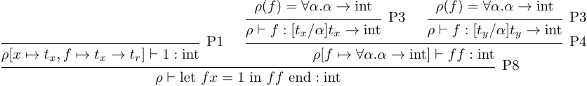
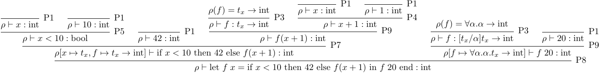

# Assignment 05
## PLC-ex5.7
Solution is in file `TypeInference.fs` line 56,110,139,153,183,189,230.

It compiles, but is rather hard to check. Due to the wording of the assignment we have decided not to implement the list type on the parser which means there is no way to test the type inference on the language.


## PLC-ex6.1
We have not changed anything but we have builded and tried to run the examples in the description of the task. This output can be seen here: PLC-ex6.1/output.txt

### Answer: Question 1
The `e3` results wiht `7`. The reason for the result is higher order functions. Allow me to explain in steps:
- We create function `add` with parameter `x`
- The function `add` then creates function `f` with parameter `y`. This function uses the parameter `x` provided by function `add`. It then calls f.
- Then we create a new function called `addTwo`that has assigned parameter `x=7`. But since parameter `y` is not assinged then `addTwo` still needs to be called with a paramter in order to be evaluated.
- Then the free variable `x` is being assigned to `77`.
- And then last but not least we call `addTwo` with the parameter coming from the `f` function and then outputs `2+5=7`

### Answer: Question 2
The output of the `e4` is a function closure for `f` with the parameter `y`. The reason for that is that the function `add` only creates a new function with the `x` parameter set to `2` in the end. In this way the function `f` still needs to have a value for parameter `y` before it can be evaluated.


## PLC-ex6.2
We have changed 
- PLC-ex6.2/Absyn.fs at line 14
- PLC-ex6.2/HigherFun.fs at line 33 and 62


## PLC-ex6.3
Also we have included an output file, PLC-ex6.3/output.txt

For this exercise we have changed the following files:
- PLC-ex6.3/FunLex.fsl at line 33 and 59
- PLC-ex6.3/FunPar.fsy at line 14, 16, and 58 

All other files have been deleted, so if you wish to compile and run the project include the files from the book repository. Check the folders `compile.sh` for information on the necessary files.


## PLC-ex6.4
### i)


### ii)



## PLC-ex6.5
### 1)
```
inferType (fromString "let f x = 1 in f f end");;
val it : string = "int"

inferType (fromString "let f g = g g in f end");;
# Failed with circularity. g in this case references itself, making an infinite type

inferType (fromString @"let f x =
  let g y = y
  in g false end
in f 42 end");;
val it : string = "bool"

inferType (fromString @"let f x =
  let g y = if true then y else x
  in g false end
in f 42 end");;
# Failed with incombatability. x is anything in the if statement, while y is set to bool in the line below. When x is then set to int in the outer scope, it creates a conflict as all branches of an if statement must return the same type. So having it return bool and int is no good.

inferType (fromString @"let f x =
  let g y = if true then y else x
  in g false end
in f true end");;
val it : string = "bool"
```

### 2)
```
// bool -> bool
> inferType (fromString "let f x = if x then true else false in f end");;
val it : string = "(bool -> bool)"

// int -> int
> inferType (fromString "let f x = x + 1 in f end");;
val it : string = "(int -> int)"

// int -> int -> int
> inferType (fromString @"
  let f x = 
    let g y =
      x + y
    in g end
  in f end
");;
val it : string = "(int -> (int -> int))"

// 'a -> 'b -> 'a
> inferType (fromString @"
  let f x = 
    let g y =
      x
    in g end
  in f end
");;
val it : string = "('h -> ('g -> 'h))"

// 'a -> 'b -> 'b
> inferType (fromString @"
  let f x = 
    let g y =
      y
    in g end
  in f end
");;
val it : string = "('g -> ('h -> 'h))"

// (’a -> ’b) -> (’b -> ’c) -> (’a -> ’c)
> inferType(fromString @"
  let tw g = 
    let app f =
      let t x = f (g x) in t end
    in app end 
  in tw end
");;
val it : string = "(('l -> 'k) -> (('k -> 'm) -> ('l -> 'm)))"

// ’a -> ’b 
> inferType(fromString @"
  let f =
    let x = x in 1 end
  in f end
");;
val it : string = "('i -> 'j)"

// TODO: 'a
```